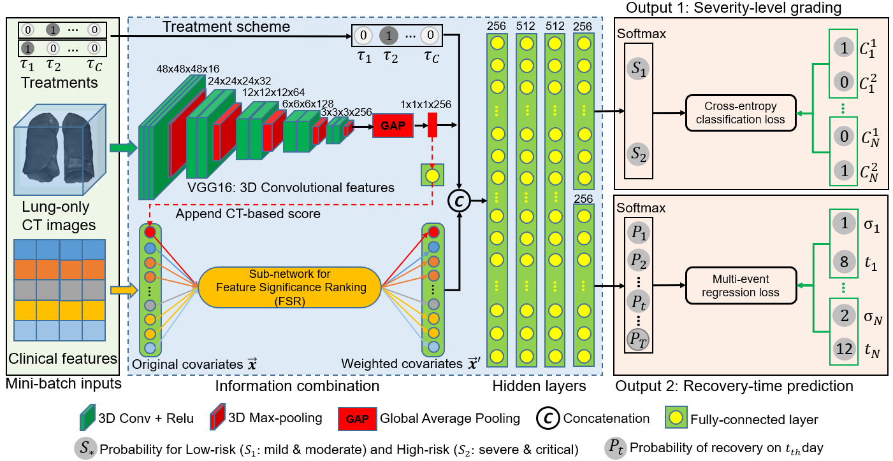

# COVID-19-Deep-Learning
tensorflow projects for diagnosis and prognostic estimation of COVID-19

> This is a deep-learning framework for identificating high-risk COVID-19 patients and estimating how long the patient can be cured。

### requirments
- Anaconda python 3.7.3 Win10
- Tensorflow 2.0.0 with GPU

## network architecture (see achitecture.pptx)


[pretrained model and 50 data subjects for evaluation](https://pan.baidu.com/s/1ybZmR6LbXXFDVDoLKkSdlA)
# password for download:8vst
#after download, unzip the checkpoint.zip, then put all directories of weight files as well as the files for normalization (feature_minv.npy and the feature_maxv.npy) to tf_covid19_care/checkpoints

#if you have any problem, please feel free to ask questions via sending email to wjcy19870122@sjtu.edu.cn
## Training

``` bash
(1) prepare your data (see the 50 data subjects for examples).
(2) cd trainers and run the file: run_train.bat.
Note: you may need to modify the configs/cfgs.py file:changing cfg.data_set to the directory of your dataset.

##  Evaluation
(1) cd tests and run the run_test.bat file.
(2) run the compute_metrics.py file to obtain the results.
```

## TODO

- [ ]  address imbalance cured-days distribution problem
- [ ]  evluation on multi-center data


